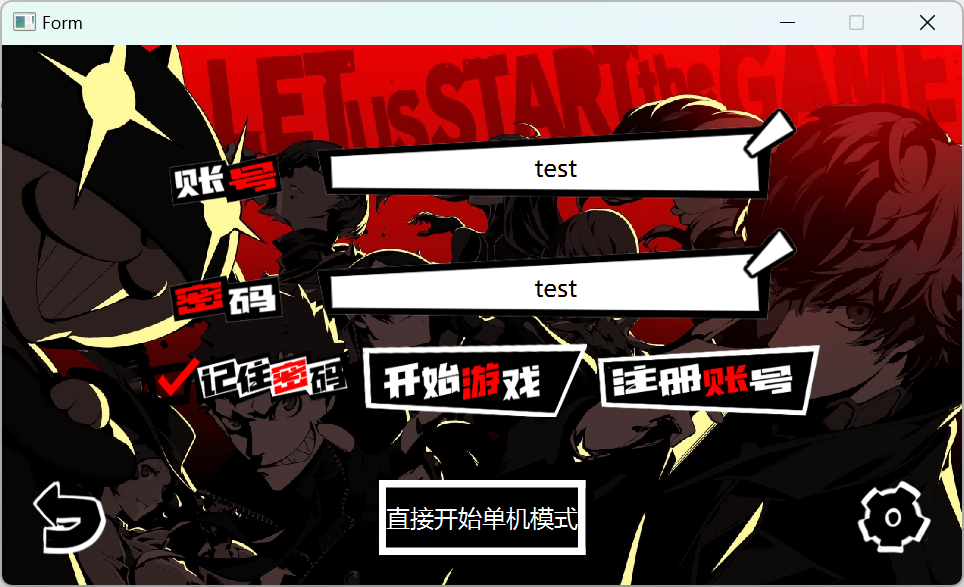

# LandLord-online
### 项目简介

**项目描述：**该项目分基于C/S架构，使用CMake进行项目管理，客户端采用Qt框架开发并使用自绘制的素材实现了美观的ui效果，同时也实现了斗地主游戏的游戏逻辑，以及单机模式下机器人ai的抢地主和出牌策略；服务端是基于C++实现的Linux服务器，实现了用户注册/登录，创建/加入/搜索房间，消息转发等功能 。

**技术实现：**

- 客户端与服务器之间使用protobuf进行消息的序列化，并使用RSA+AES的方式对通信数据进行加密，并封装了socket的原api解决了粘包问题
- 服务端基于多线程+多reactor模型，使用epoll的IO多路复用技术，能够处理高迸发请求
- 服务端采用MySql数据库储存玩家信息，使用Redis作为缓存，储存房间信息，密钥信息等
- 客户端使用Qt框架开发，使用qss，以及自绘制ui素材进行界面美化，游戏ui效果美观
- 客户端使用Qt的通用模块，如信号槽，线程池，容器，实现了游戏的逻辑，并分为单机和多人模式，并实现了单机模式下机器人的抢地主，出牌策略。

### 环境

#### 客户端

| qt版本|编译器|CMake 版本| 外部库|
| ------ | ---- | ---- | ---- |
| 5.15.2 |MinGW64|3.5| protobuf,openssl |

#### 服务端

| 系统              | 编译器  | CMake 版本 | 外部库                       |
| ----------------- | ------- | ---------- | ---------------------------- |
| Linux ubantu20.04 | MinGW64 | 3.15       | protobuf,openssl,mysql,redis |

### 截图

##### 登录界面

##### 模式选择

##### 游戏界面

